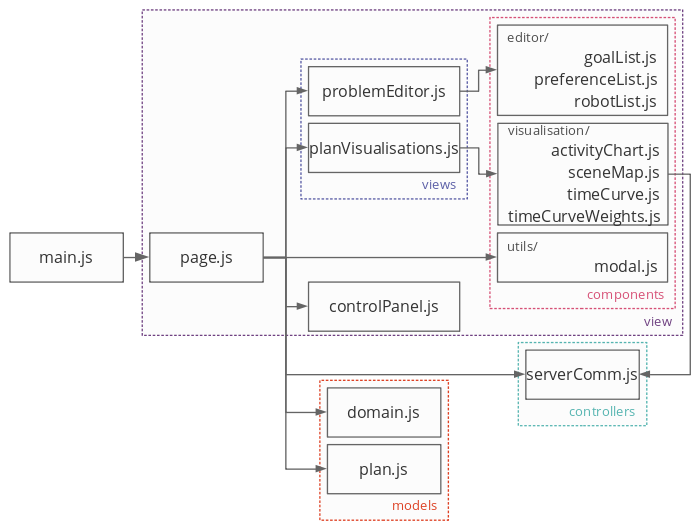

# Planner-Visualiser Framework [![CC BY-NC 4.0][cc-by-nc-shield]][cc-by-nc]

> *Authors*: **Pierre Le Bras** and **Yaniel Carreno** <br>
> *Version*: 4 - Live Editing, Planning and Visualising

- [Description](#description)
- [Running](#running)
- [Updating the Model](#updating-the-model)
- [Dispatching the Plan](#dispatching-the-plan)
- [Developer Guide](#developer-guide)
    - [Flask Application](#flask-application)
    - [Front-End](#front-end)
- [Framework Architecture](#framework-architecture)
- [File Structure](#file-structure)
- [Domain Model and Problem Writer](#domain-model-and-problem-writer)
    - [Environment Model](#environment-model)
    - [Robots Model](#robots-model)
    - [Goals and Preferences Model](#goals-and-preferences-model)
    - [Problem Model](#problem-model)
    - [Problem Writer](#problem-writer)
- [Task Allocator and Planner](#task-allocator-and-planner)
- [Plan Parser](#plan-parser)
- [Front-End Architecture](#front-end-architecture)


## Description

This instance of the Planner-Visualiser framework builds on top of previous offline planning iterations to support live problem edition, plan generation and plan visualisation. It integrates together:
 - a graphical interface for guiding users in specifying robots, goals and preferences for their problem, in accordance with domain constraints;
 - a task-allocation and planner system generating plans; and
 - a visualisation interface presenting the plan to users for safety checks and approval.

This framework aims to be connected with a plan dispatch system, implementing the approved plans to either simulated or real robotic platforms.

## Running

You first need to install the project dependencies:
```shell
$ pip install -r requirements.txt
```

You can then launch the application:
```shell
$ python run.py
```

The python Flask application will start and automatically launch the user interface in your browser. Use the interface to load the domain, edit your problem, generate a plan and visualise it.

## Updating the Domain

To update the domain used by the application, the following files needs updating:
 - `app/domain/data/map.json`
 - `app/domain/data/distance_time.json`
 - `app/domain/data/robots.json`
 - `app/domain/data/goals.json`
 - `app/planner/inputs/ontology.yaml`
 - `app/planner/domain.pddl`
 - `app/planparser/plan_config.py`

Details on the format and content of these files can be found below.

## Dispatching the Plan

Integrating the plan dispatch process can be done in the `app/controller.py` file, specifically in the `execute_plan()` function:
```python
def execute_plan():
    # code to launch plan
    success = True
    # different messages sent to the interface
    if success:
        return json.dumps({'type':'success', 'msg':'Success message, e.g. where to monitor plan progress.'})
    else:
        return json.dumps({'type':'error', 'msg':'Error message.'})
```

## Developer Guide

### Flask Application

The overall framework architecture is detailed below.

You can run `python run.py -d` to enter the debug mode. The application and interface are reloaded on every file save.

To enter the debug mode, allowing you to have the application and interface reloaded on every file save, you can run the following command:
```shell
$ python run.py -d
```

### Front-End

The frontend application is contained within the `app/frontend` directory. The sources (script and styles) are located in the `src` subfolder and bundled together in the `app/dist` subfolder, along with the top level file for the interface `index.html`.

If not already installed, you will need to download the dependencies (tey will be saved in the `node_modules` directory):
```shell
$ npm install
``` 

The sources are bundled using Rollup and managed with NPM. To run the bundling process, run the following command:
```shell
$ npm run build
```

If you wish to launch continuous bundling, restarting on every file save, run this command:
```shell
$ npm run watch
```

## Framework Architecture

The main script, `run.py` will launch two processes:
 - a Flask application, serving a frontend application and coordinating most operations in the backend; and
 - open the frontend interface in a web browser.

The following flow of operations is then triggered:
 - The user makes the interface load the *domain model* data and open the **Plan Editor**;
 - The user interacts with the **Plan Editor** to generate specifications regarding the robots, goals and preferences for a particular problem;
 - When the specifications are complete, the user triggers the plan generation:
    - The **Problem Writer** compiles the *domain model* and the user's problem specifications into *problem files*;
    - The framework launches a subprocess to generate the plan:
        - The **Task Allocator** reads the *problem files*, allocates goals to robots and generates a single *problem*;
        - The **Planner** reads the *problem* and *domain* files and generates the *plan*;
    - On completion of the subprocess, the **Plan Parser** reads the *plan*, generates action and state data and send those to the frontend application;
 - The **Plan Visualisations** receive the action and state data to render plan for the user;
 - The user may interact with the **Plan Visualisations** to adjust the view. On occasions, the **Plan Parser** maybe queried to further analyse the plan data and return updated action or state data;
 - The user may request to return to the **Plan Editor** to adjust problem specifications.


## File Structure

```
|-- PlanVisLive/
    |-- run.py
    |-- requirements.txt
    |-- README.md
    |-- img/
    |-- app/
        |-- domain/
        |-- frontend/
        |-- planner/
        |-- planparser/
        |-- __init__.py
        |-- routes.py
        |-- controller.py
```

The `README.md` file and `img` folder constitute the documentation files.

The `run.py` script launches the Flask application and opens a web browser to render the frontend. The `requirements.txt` simply list dependencies for this project.

The Flask application is contained within the `app` folder:
 - the `domain` folder contains the domain model files and problem writer module;
 - the `frontend` folder contains the user interface code: sources, dependencies, build scripts and bundled scripts and styles for the interface itself;
 - the `planner` folder contains the task allocator and planner modules;
 - the `planparser` folder contains the plan parser module;
 - the `__init.py__` file instantiate the Flask application;
 - the `routes.py` file describes the frontend - backend API; and
 - the `controller.py` file contains function coordinating the various modules.

## Domain Model and Problem Writer

The domain model contains data that will assist the user in specifying requirements for their problem. Then, with the same domain model and the problem specification defined by the user, the problem writer will compile problem files.

```
|-- domain/
    |-- __init__.py
    |-- problem_writer.py
    |-- data/
        |-- map.json
        |-- distance_time.json
        |-- robots.json
        |-- goals.json
        |-- problem.json
```

 - the `__init__.py` file sets up accessors to the domain model and the problem writer module;
 - the `problem_writer.py` file contains the problem writer module; 
 - the `data` folder contains the files describing the domain model:
   - `map.json` and `distance_time.json` contain data relative to the environment;
   - `robots.json` lists the robots and describes their parameters and capabilities;
   - `goals.json` describe the possible goals and preferences;
   - `problem.json` compiles the problem specifications last edited by the user.

### Environment Model

The model for the plan environment is defined in `map.json` and `distance_time.json`.

`map.json` has the following structure:
```json5
{
    "dimensions":{
        "x":[min_x_value, max_x_value],
        "y":[min_y_value, max_y_value],
        "z":[min_z_value, max_z_value]
    },
    "points":[
        {
            "name": point_name,
            "coordinates": [x_value, y_value, z_value],
            "neighbors": [nbr1_name, nbr2_name, ...]
        },
        ...
    ],
    "waypoints":[
        {
            "name": waypoint_name,
            "alias": point_name,
            "type": waypoint_type
        },
        ...
    ],
    "related_waypoints":[
        [wp1_name, wp2_name],
        ...
    ],
    "objects":[
        {
            "type": object_type,
            "position": waypoint_name
        },
        ...
    ],
    "objects_types":[
        obj_type_1, obj_type_2, ...
    ]
}
```

 - `dimensions` lets you set the axes boundaries of the environment, which will be used when display a map of the environment;
 - `points` lets you list all the positions robots may reach in the environment:
    - `name` is the point's name as defined by the platform the plan will be implemented in, e.g. simulation;
    - `coordinates` are the point's coordinates along the axes defined in `dimensions`;
    - `neighbors` lists the name of other points in the environment which are direct neighbors to this point, and therefore helps construct the neighborhood graph for the environment;
 - `waypoints` lets you define a subset of points to use specifically for the planner, defining a subset helps in reducing the search space for the plan generations:
    - `name` the waypoint's name as used by the planner and in the problem files;
    - `alias` the point's name (from the list `points`) associated to that waypoint;
    - `type` the waypoints' type, used to filter the waypoints a robot can start from in the problem editor;
 - `related_waypoints` lets you list pairs of waypoints that the planner should consider as related, e.g. for composite action involving multiple robots at different locations;
 - `objects` lets you list specific objects and their position in the environment which can be used for specific actions:
    - `type` the object's type;
    - `position` the waypoint's name where the object is located;
 - `objects_types` lets you list the different types of object in the environment, it is used to help users specify correct goals for their problems.

Given the `waypoints` define in `map.json`, you also need to list the temporal distances separating them, which will be compiled in the problem files and used by the planner to define movements. These distances are described in `distance_time.json`:
```json5
[
    [wp1_name, wp2_name, distance],
    ...
]
```

### Robots Model

The robots model is contain within the `robots.json` file. It lists the robots accessible by the planner and displayed to the user when specifying their problem, along with their default properties. It also lists the capabilities and types of robots:
```json5
{
    "robots":[
        {
            "name": robot_name,
            "id": robot_id,
            "type": robot_type,
            "waypoints": waypoint_base_name,
            "position": waypoint_name,
            "available": boolean,
            "energy": integer (0,100),
            "recharge_points": [wp1_name, wp2_name, ...],
            "capabilities":[capability1, capability2, ...],
            "advanced": {
                "fluent_name": fluent_value,
                ...
            }
        }
    ],
    "capabilities":[
        capability1, capability2, ...
    ],
    "types":[
        type1, type2, ...
    ]
}
```

 - `robots` lets you list the robots accessible by the plan:
    - \* `name` is the unique robot name, as used by the planner;
    - `id` is the unique id given to the robot, used by the interface;
    - \* `type` is the robot's type, used to filter which waypoints it can start from;
    - `waypoints` is the waypoints' base name for waypoints the robot can access, e.g. `"wpg"` for waypoints `"wpg1"` or `"wpg2"`;
    - \** `position` is the default initial waypoint the robot is at before the plan gets implemented;
    - \** `available` is the default availability of the robot for the plan;
    - \** `energy` is the default initial fuel level (between 0 and 100) of the robot before the plan gets implemented;
    - `capabilities` lists the robot's capabilities;
    - `advanced` are the various fluent parameters associated to the robot, e.g. speed, recharge rate, etc.;
 - `capabilities` lets you list all the possible capabilities robots can have (it should match the capabilities in `app/planner/inputs/ontology.yaml`);
 - `type` lets you list all the possible robot types.

The filed marked with an \* are displayed in the problem editor, those marked with \** can be changed in the problem editor.

### Goals and Preferences Model

The goals and preferences models are described in `goals.json`. The aim of these models is simply to provide signature for the goals and preferences/constraints statements in the problem files.

```json5
{
    "goal_types":[
        {
            "name": goal_name,
            "parameters": [parameter1, parameter2, ...]
        },
        ...
    ],
    "preferences_types":[
        {
            "name": preference_name,
            "goals": [goal1, goal2, ...]
        },
        ...
    ],
    "preference_predicates":[
        {
            "name": predicate_name,
            "type": predicate_type,
            "parameters": [parameter1, parameter2, ...]
        }
    ]
}
```

 - `goal_types` lets you list the various goals that the user can specify:
    - `name` is the goal's name;
    - `parameters` is the list of parameter types, in order, that the goal expects, it is used to assist the user in selecting appropriate parameters, the available parameter types are:
        - `"robot"` which will list the robots to the user;
        - `"waypoint"` which will list all waypoints to the user; and
        - object types (as listed in `map.json`) which will list a subset of waypoints (where this type of object are located) to the user;
 - `preferences_types` lets you list the preferences available to the user:
    - `name` is the preference's name, typically: `"always"`, `"sometime"`, `"within"`, `"at-most-once"`, `"sometime-after"`, `"sometime-before"`, `"always-within"`, `"hold-during"`, `"hold-after"`;
    - `goals` is the list of goal types needed for this preference, typically a combination of `"predicate"` and `"number"`, e.g. `"within"` require one `"number"` goal followed by one `"predicate"` goal;
 - `preference_predicates` lets you specify which predicates are available to the user:
    - `name` is the predicate's name;
    - `type` is the predicate's type, typically `"state"` or `"function"`:
        - if the type is set to `"state"`, make sure that your predicate name matches one of your domain state;
        - if the type is set to `"function"`, make sure that your predicate name matches on of your domain fluent;
    - `parameters` is the list of parameters for this predicate, typically `"robot"`, `"waypoint"` or one of your object type (as listed in `map.json`);
        - if the predicate `type` was set to `"function"`, the problem editor will automatically append a list of arithmetic operators and a integer input.

### Problem Model

The problem model is contained within `problem.json`. It describes the problem specifications set by the user via the problem editor interface.

```json5
{
    "robots": [
        {
            "id": robot_id,
            "name": robot_name,
            "position": waypoint_name,
            "energy": integer,
            "available": boolean
        },
        ... 
    ],
    "goals": [
        {
            "id": goal_id,
            "name": goal_name,
            "parameters": [parameter1, parameter2, ...]
        },
        ... 
    ],
    "preferences": [
        {
            "id": preference_id,
            "type": preference_type,
            "weight": integer,
            "goals": [
                {
                    "name": preference_goal_name,
                    "type": [parameter1, parameter2, ...]
                },
                ...
            ]
        },
        ...
    ]
}
```

This data is updated every time the user edits the problem specifications on the problem editor and request a new plan or explicitly save this problem.

The problem editor will read this model, along with other model data, in order to present the user with their latest specifications.

### Problem Writer

The problem writer will compile data from the domain model files (`map.json`, `distance_time.json`, `robots.json` and `goals.json`), along with the problem model set by the user in `problem.json`, and write files in the `app/planner` directory in preparation for the task allocator and planner modules:
 - `inputs` is the directory used by the task allocator module:
    - `robots.txt` lists the robots and their capabilities;
    - `goals.txt` lists the goals desired by the user;
    - `map.txt` lists the waypoints of the environment, including data about their type, position, alias, and if a robot is initially situated there;
 - `problem_definition` is the directory where data directly used by the planner is situated:
    - `objects.txt` lists the object for the planner, including the robots to use and waypoints;
    - `preferences.txt` lists the preferences set by the user;
    - `metric.txt` described the minimization goal for preferences;
    - `initial_state.txt` describes the environment data for the planner (objects in the scene, related waypoints, distances between waypoints), the fluents associated to robots (e.g. speed) and the initial state of robots (position, energy).

## Task Allocator and Planner

The task allocator and planner modules are contained within the `app/planner` directory.

```
|-- planner/
    |-- inputs/
    |   |-- goals.txt
    |   |-- map.txt
    |   |-- robots.txt
    |   |-- ontology.yaml
    |-- problem_definition/
    |   |-- objects.txt
    |   |-- initial_state.txt
    |   |-- preferences.txt
    |   |-- metrics.txt
    |-- task_allocation/
    |   |-- capALLOC.py
    |   |-- goalALLOC.py
    |-- planner/
    |   |-- popf
    |   |-- optic-clp
    |   |-- optic-cplex
    |-- libTAP.o
    |-- tap.cpp
    |-- tap.o
    |-- tap
    |-- domain.pddl
    |-- problem.pddl
    |-- plan.pddl
```

The `tap` program (`tap.cpp`, `tap.o` and `libTAP.o`) is coordinating both the task allocator and the planner.

The task allocator (in the `task_allocation` directory) will read the files the `input` directory to allocate robots to goals. This allocation depends on the robots' capabilities (written in `robots.txt` by the problem writer), the goals set by the user (written in `goals.txt` by the problem writer) and the spatial situation (written in `maps.txt` by the problem writer). The `ontology.yaml` file ensures a correct match between goals and robots capabilities.

After calling the task allocator, `tap` then compiles the `problem.pddl` file. It does so by combining the files written by the problem writer in the `problem_definition` directory along with the task allocation statements, which effectively serve as a set of restrictions for the range of operation of robots, reducing the search space for the planner.

The planner is then called, loading the `domain.pddl` and `problem.pddl` files, generating a plan and writing in the `plan.pddl` file.

## Plan Parser

The plan parser module is contained within the `planparser` directory.
```
|-- planparser/
    |-- __init__.py
    |-- parser_exceptions.py
    |-- utils.py
    |-- plan_reader.py
    |-- roadmap.py
    |-- action_parser.py
    |-- state_parser.py
    |-- state_projection.py
    |-- plan_config.py
```

 - `__init__.py` contains the module's top-level functions, called by the framework `controller.py` and calling the rest of the files;
 - `parser_exceptions.py` and `utils.py` contain utility functions for the rest of the module;
 - `plan_reader.py` is dedicated to reading the data from `planner/plan.pddl` and creating raw actions;
 - `roadmap.py` reads the data from `domain/data/map.json` in order to assist the action and state parsers in understanding spatial information;
 - `action_parser.py` then parses this raw actions into action data;
 - `state_parser.py` infers state data from the action data;
 - `state_projection.py` creates mappable information for the states.

Finally, `plan_config.py` contains the rules for interpreting and parsing the plan data.

`plan_file_comment` informs the characters, or list of characters, to check for excluding lines in the plan which are comments, i.e. not actions. Similarly, `plan_action_splits` is the list of strings used to separate values in the action lines:
```python
plan_action_splits = [': (', ' ', ')  [', ']']

line = '0.000: (action param1 param2)  [10.000]'

# split start from rest: plan_action_splits[0]
first_split = ('0.000', 'action param1 param2)  [10.000]')

# split action from duration: plan_action_splits[2]
second_split = ('0.000', ('action param1 param2', '10.000]'))

# clean duration: plan_action_splits[3]
third_split = ('0.000', ('action param1 param2', ('10.000')))

# separate action terms: plan_action[1]
fourth_split = ('0.000', (('action', 'param1', 'param2'), ('10.000')))

```

`composite_actions` informs the parser on which actions are composite, i.e. a higher level action actually coordinating multiple robots, each performing separate tasks. For each composite action, it lets you list its sub-actions, indicating the parameters they inherit as well as their relative timing using duration percentage:
```python
composite_actions = {
    'comp_action':[
        # [sub-action+params, relative start time (duration %), relative duration (duration %)]
        [['sub_action1', 1, 3], 0.0, 1.0],
        [['sub_action2', 2, 4], 0.5, 0.5]
    ]
}

action = {
    'terms': ['comp_action', 'param1', 'param2', 'param3', 'param4'],
    'start': 1.000,
    'duration': 10.000
}

sub_action1 = {
    'terms': ['sub_action1', 'param1', 'param3'],
    'start': 1.000, # 1.000 + 0% of 10.000
    'duration': 10.000 # 100% of 10.000
}

sub_action2 = {
    'terms': ['sub_action1', 'param2', 'param4'],
    'start': 6.000, # 1.000 + 50% of 10.000
    'duration': 5.000 # 50% of 10.000
}
```

`action_parse` informs on the parsing rule for raw action data:
```python
action_parse = {
    'navigate': {
        'actor': 1,
        'waypoints': [2, 3],
        'parameters': [2, 3],
        'description': ['moving from', 2, 'to', 3]
    }
}
```
 - `actor` indicates which of the action parameters in the robot;
 - `waypoints` is optional and only necessary for actions involving movement, it indicates which parameters are the start and end positions, calling the `roadmap.py`'s A\* path planning to estimate the intermediate movements;
 - `parameters` lets you indicate which parameters you which the action keeps, notably to infer states later;
 - `description` lets you describe, using a combination of string and parameter indices, the natural language description of the action. The actor is automatically prepended to this description.

`action_to_state` contains the rules for inferring states from the action data:
```python
action_to_state = {
    'navigate':{
        'effect': {'name':'at', 'parameters': [1]},
        'initial': {'name':'at', 'parameters': [0]}
    },
}
```
Each action can infer two possible states. Most of the time, it would generate an *effect* state, i.e. resulting from the action. In case the action is the first for the robot, it will also infer an *initial* state, i.e. before the action took place. Each inference rules has two fields:
 - `name` the new state's name;
 - `parameters` the action parameters transferred to the state.

`state_parse` informs on the parsing rules for the states:
```python
state_parse = {
    'at': {
        'description': ['is at', 0],
        'features': {
            'position': 0
        }
    }
}
```
As with actions, each state is expected to have a rule to generate its natural language `description`, using strings and parameter indices. The second parsing rule concerns the state's **features**, used to generate a projection of the plan.

**Each state must have the same set of features**, each identified with a name and describing which parameter (using indices) is the feature value. Note that features can be *categorical*, *numerical*, or *ordinal*:
```python
'features': {
    'feat_1': [1, 'c'], # -> categorical feature, value = parameter 1 
    'feat_2': [0, 'n'], # -> numerical feature, value = parameter 0 
    'feat_3': [2, 'o'], # -> ordinal feature, value = parameter 2 
    'feat_4': 3, # -> default, numerical feature, value = parameter 3
}
```

In case some state do not have a parameter to fill a categorical feature, you can use the index `-1`.

To match ordinal feature names to numerical values, you should use the `ordinal_feature` rule:
```python
ordinal_feature = {
    'feat_3':{
        'name_1': 0,
        'name_2': 1,
        'name_3': 2
    }
}
```

Two feature names are reserved:
 - `'position'` will automatically create features for the spatial dimensions described in `domain/data/map.json`, matching a waypoint name to coordinates;
 - `'actor'` will automatically use the robot name (use '-1' to fill the rule).

## Front-End Architecture

The following chart shows the dependencies between JavaScript modules of the front-end (`src/scripts`):


The `main.js` script directly implements an instance of `page.js`. This instance then loads a `controlPanel.js` instance, which will be used to control the various stages of the application.

When needed, the page instance will use `serverComm.js` to send and receive data from the backend. This data is stored in two instances (one of each) of the model modules `domain.js` and `plan.js` which are used to facilitate access to specific data.

Given the stage the application is in, the page instance will instantiate one of the views module `problemEditor.js` and `planVisualisation.js`, each instantiate specific view components.

Each of the view modules import styles from the `scr/styles` directory.

This sources are all bundled using `main.js` as the root element. The bundled and minified scripts and styles are saved into two files in the `app/dist` directory: `PlanVis.js` and `PlanVis.css`. These files are then called by the `index.html` file which is served by the Flack application onto a local web server: `127.0.0.1:2000`. Note that the port number defaults to `2000`, but can be customized when calling the `run.py` script using the `-p` option.

---
This work is licensed under a [Creative Commons Attribution 4.0 International
License][cc-by-nc].

[![CC BY-NC 4.0][cc-by-nc-image]][cc-by-nc]

[cc-by-nc]: http://creativecommons.org/licenses/by-nc/4.0/
[cc-by-nc-image]: https://i.creativecommons.org/l/by-nc/4.0/88x31.png
[cc-by-nc-shield]: https://img.shields.io/badge/License-CC%20BY--NC%204.0-lightgrey.svg
